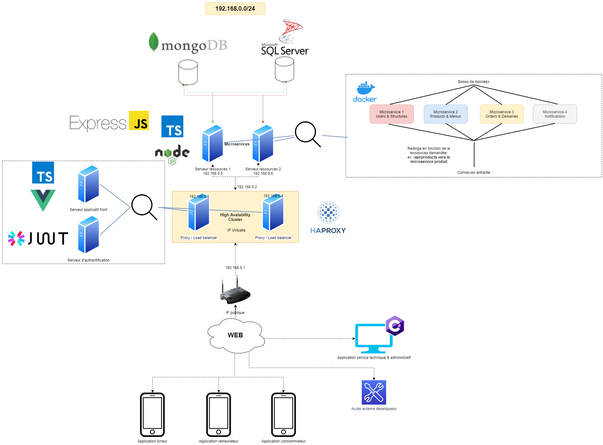

# CloudSaaS
## Présentation de la structure de fichiers

- `api` : Ensembles des microservices nécessaires au fonctionnement de l'API REST
- `ceseat-lib` : Bibliothèque de composants réutilisables Vue (publié sur npm : https://www.npmjs.com/package/ceseat-lib)
- `haproxy` : Configuration des serveurs proxy Haproxy
- `jwt_auth` : Serveur d'authentification basé sur JWT
- `vue` : 3 applications Vue 2 destinées aux utilisateurs finaux, restaurateurs et livreurs

## Diagramme de déploiement (UML)

## Architecture

